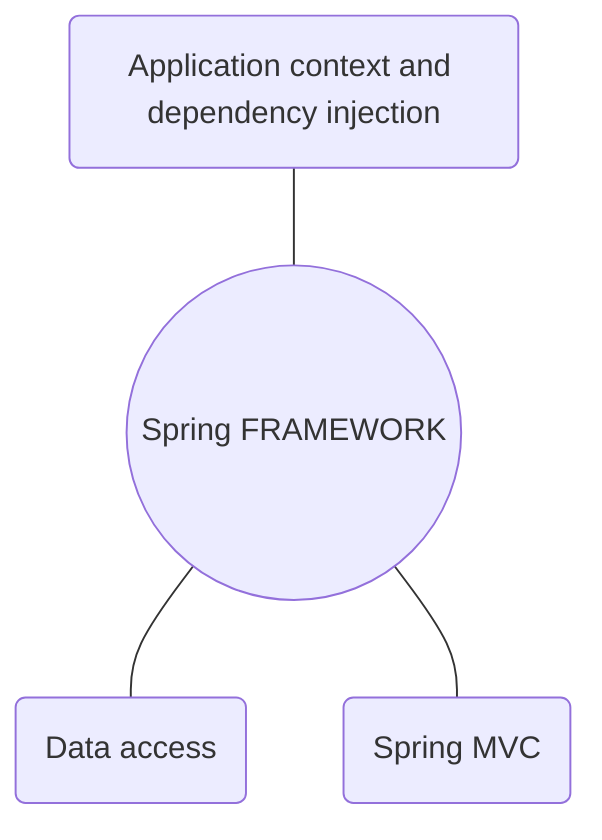
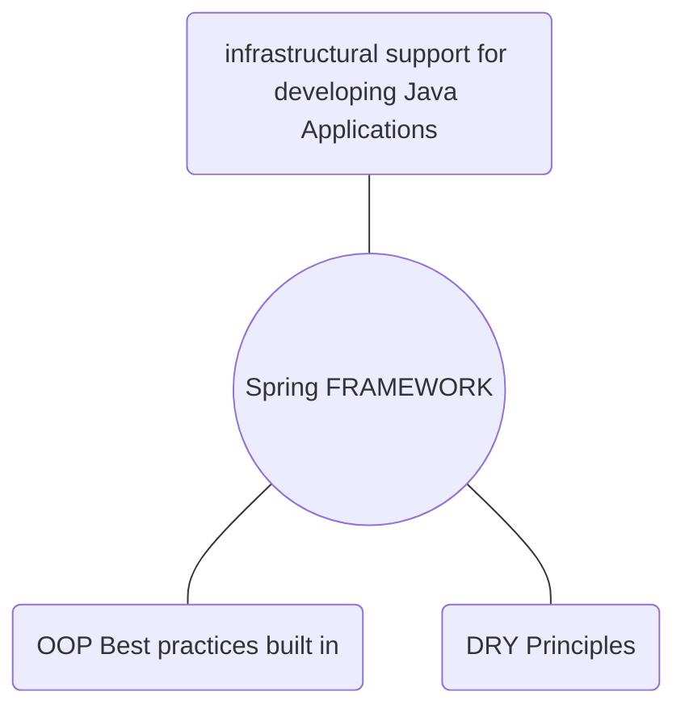

# Spring FRAMEWORK

# Visit the [Spring Ecosystem](https://springtutorials.com/spring-ecosystem/) and have a look around.
**Spring handles the infrastructure, so you can focus on Your Application.**
> Spring Framework is a Java platform that provides comprehensive infrastructure support for Developing Java Applications.

What does Spring framework provide?
- Application context and dependency injection
- Data access
- Spring MVC



---
## Application context and dependency injection
### Dependency Injection
> declare each dependencie a class needs and spring will make sure the have they instances they require.

1. Handling interrelated dependencies among objects.
2. A wrapper -> application context
3. Spring manages object instances

- objects hold data
- instances of classes have methods or functions
- all classes that share the same service should contact the same instance
- share object instances "the singelotn pattern". The life cycle of an instance.
- spring manages the instances and manages them
- spring connects them together

---
## Data access
### database connectivity
> Most common for Java Developers.
spring comes with connectivity, querying, transaction management and more.

---
## Spring MVC
### web applications
> Build web applications easy
- dynamic web page applications
- REST APIs
- --
```
{
	name: SpringFramework
	level: Over 9000
	String:"But What does it do? Find out below."
}
```
# Spring Framework
Framework for providing comprehensive infrastructural support for developing Java Applications
OOP (Object Oriented Programming) Best practices built in
DRY (Don't Repeat Yourself) Principles



---
## Definitions
* POJO - Plain old Java Object
* Java Beans - Simple objects with only getters and setters
* Spring Beans - POJOs configured in the application context
* DTO  (Data Transfer Object) - Bean used to move state between layers
----

## Inversion of Control (IOC)
-  IOC provides mechanism of dependency injection
-  Application Context wraps the Bean Factory which serves the beans at the runtime of the application
- Spring Boot provides auto-configuration of the Application Context


***
> Start daily exercises [in the Code Gym](https://codegym.cc/)
{: .prompt-tip }

# [Start with: Start your journey to become a Java Developer]()
# [Continue with: Spring]()
