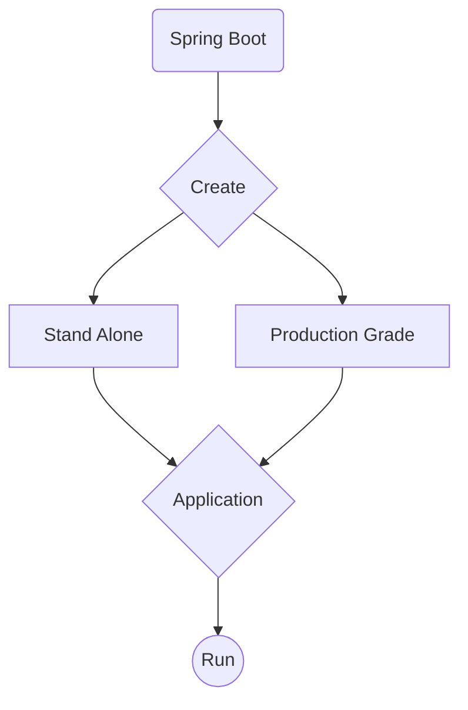
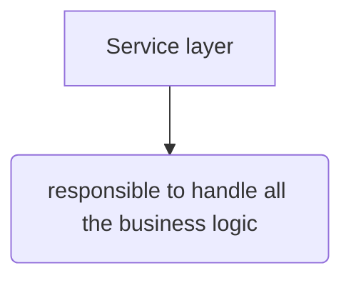
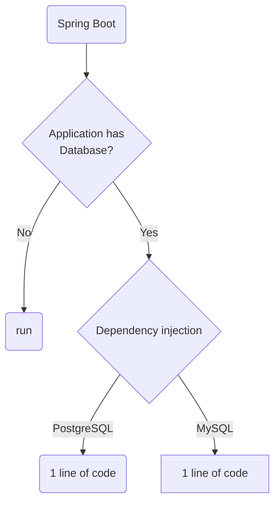

# Spring BOOT


Please sit down and relax, start your IDE and follow this video. It will give you experience in how to use Spring Boot.



_Link to video [Spring(BOOT)](https://www.youtube.com/watch?v=9SGDpanrc8U)_

## What is Spring Boot?

> Spring Boot is an amazing framework for building Java applications. It makes it easy to create stand-alone,
> production-grade Spring based Applications that you can "just run".
{: .prompt-info }
---

> This next video is a little outdated, but many principles still apply. Just watch the video, you don't have to do the
> exercise unless you really want to, it might be difficult. The video does show the progress of Spring compared to 
> video we just did.
{: .prompt-danger }


[link to  video](https://www.youtube.com/watch?v=vtPkZShrvXQ)


## Breakdown:

- Bootstrap your application
- Spring Boot is a tool to create Spring Based applications
- It's stand-alone
- Production-grade, it is NOT "Hello Wolrd"
- Just Run: it makes it very easy, and you can skip a lot of configuration

## A Flow Chart to show where you start with Spring Boot.



As we can see Spring BOOT makes it very easy to build applications
[Bootstrap your project](https://start.spring.io/)

Here is an example in a very wide overview how Spring Boot helps in development:

We usually make a Service Layer, more on this topic in abstraction layers later on, for now lets see what a service
layer does:


Lets say we use a database,and want to use Spring to build CRUD functions, lets see:


> Using a datbase for CRUD operations:
> SpringBoot depedency injection = switching databases is changing one line of code.
{: .prompt-info }

What you need to know:
```php
spring(boot) = "al lot of flexibility with dependencies"
```

This graph tries to  show you why, it tells us that it is just 1 line of code to change the behavior of a Spring Boot
application, and also just 1 line of code to tell the application what type of database we use:



***
> Start daily exercises [in the Code Gym](https://codegym.cc/)
{: .prompt-tip }

# [Start with: Start your journey to become a Java Developer]()

# [Continue with: Spring]()
