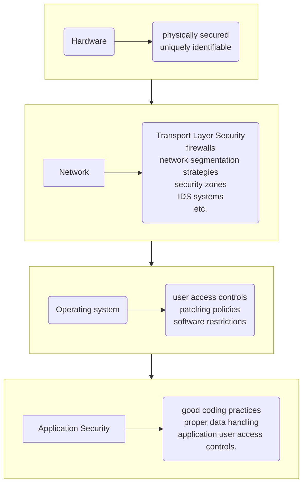

# [What is Spring Security?](https://www.youtube.com/watch?v=F_wvX22_Vhc "What is Spring Security")

> In a nutshell, it’s a library that can be utilized and customized to suit the demands of the programmer.
{: .prompt-info }




Spring Security is a powerful and highly customizable authentication and access-control framework. It is the de-facto
standard for securing Spring-based applications. Because it is a part of the same Spring family as Spring Web MVC, it
works well together. Its major function is to manage authentication and authorization at both the Web request and method
invocation levels.

> Spring Security is a framework that focuses on providing both authentication and authorization to Java applications.
> Like all Spring projects, the real power of Spring Security is found in how easily it can be extended to meet custom
> requirements
{: .prompt-info }

### Spring security works on the following four core concepts

- Authentication
- Authorization
- Password Storage
- Servlet Filters

### These are the major advantages of Spring security

- Protection against attacks like session fixation, and clickjacking.
- Spring MVC integration.
- Support Java Configuration.
- Portable
- Integration of Servlet API
- Protect against brute force attacks.

---

> ## READ:  [Introduction to Spring Security](https://www.geeksforgeeks.org/introduction-to-spring-security-and-its-features/ "GeeksForGeeks")
{: .prompt-tip }


Setting up spring-security-core:

You have to add the following dependency inside your pom.xml file.

```xml
<properties>
	<spring-security.version>5.3.4.RELEASE</spring-security.version>
	<spring.version>5.2.8.RELEASE</spring.version>
</properties>

<dependency>
	<groupId>org.springframework.security</groupId>
	<artifactId>spring-security-core</artifactId>
	<version>${spring-security.version}</version>
</dependency>
```

----
For setting up spring-security-web:

You have to add the following dependency inside your pom.xml file.

```xml
<dependency>
	<groupId>org.springframework.security</groupId>
	<artifactId>spring-security-web</artifactId>
	<version>${spring-security.version}</version>
</dependency>
```

---

## Introduction to Spring Security

The Spring Security project is one of the most powerful abstractions from the perspective of the developer. However, it
is also one of the most complex, considering everything that it includes.

## Spring Security, the problems it tries to solve, and the complexities that it abstracts.

In order to fully grasp the power of Spring Security, we first need to know where it fits in. Security should be tackled
in a layered fashion. This layered security pattern provides you distinct focus areas to secure, monitor, and tune.

- Most often, the focus in this layered model starts at the lowest level. And that is the physical hardware. Hardware
  must be physically secured and uniquely identifiable to other trusted systems.
- After you plan to secure the hardware, you start looking at the network. Here we deployed Transport Layer Security,
  firewalls, network segmentation strategies like VLANs, and security zones, IDS systems, and the list goes on and on.
- We then moved to the operating systems where user access controls, patching policies, and software restrictions
  provide additional layers of security for our system as a whole.
- And finally, we look at application security. And this is where we focus on good coding practices, proper data
  handling, and application user access controls.



---

## Where does Spring Security fit in? It's in the application space itself.

Spring Security is a project that provides amazing abstractions in the J2EE, now called Jakarta EE application space.
These abstractions helps solve the various issues of traditional Java Enterprise security, like portability and vendor
lock-in. By abstracting these topics, we are providing a clean and efficient way to provide security services. Spring
Security isn't just for enterprise developers. It also provides valuable tools for internet-facing applications running
in the JVM. Obviously, as a Spring project, it plays very nicely with the Spring framework as a whole, but that isn't a
requirement.

You can use Spring Security with traditional Spring-based WAR applications as well as raw Java applications. Most of
Spring Security is designed to focus on authentication and authorization. These are often the most critical needs at the
application level outside of secure coding practices themselves.


***
> Start daily exercises [in the Code Gym](https://codegym.cc/)
{: .prompt-tip }

# [Start with: Start your journey to become a Java Developer]()

# [Continue with: What is Maven]()
