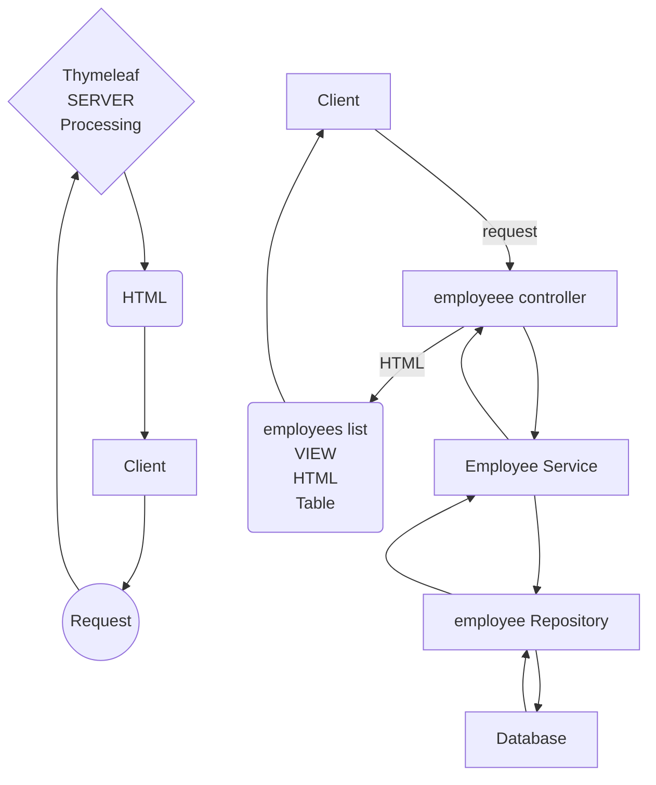

# What is Thymeleaf?

_Thymeleaf logo_

# [ThymeLeaf](https://www.youtube.com/watch?v=hoVUmn8ZCOo "TUTORIAL")




> * Thymeleaf is a server-side Java template engine for both web and standalone environments, capable of processing HTML, XML, JavaScript, CSS and plain text (RAW).
> * It is commonly used to generate HTML views for web apps.
{: .prompt-info }


---
## What is a Thymeleaf template?
- HTML with Thymeleaf expressions
- Dynamic content from Thymeleaf expressions


The Thymeleaf engine will parse a Thymeleaf Template.
It uses Java model data to replace the positions marked on the Thymeleaf Template to create a new text in the HTML Page.

---
# Model + Inclusion statement + view = result

## MODEL
```java
public class Person {
    private String firstName;
    private String lastName;
}
```

## INCLUSION STATEMENT
```html
<div th:replace="fragments/header :: header">...</div>
```

## VIEW(Thymeleaf Template)
```html
<!DOCTYPE html>
<html>
<head>
    ...
</head>
<body>
...
<div th:replace="fragments/header :: header">
    <!-- ============================================================================ -->
    <!-- This content is only used for static prototyping purposes (natural templates)-->
    <!-- and is therefore entirely optional, as this markup fragment will be included -->
    <!-- from "fragments/header.html" at runtime.                                     -->
    <!-- ============================================================================ -->
    <div class="navbar navbar-inverse navbar-fixed-top">
        <div class="container">
            <div class="navbar-header">
                <a class="navbar-brand" href="#">Static header</a>
            </div>
            <div class="navbar-collapse collapse">
                <ul class="nav navbar-nav">
                    <li class="active"><a href="#">Home</a></li>
                </ul>
            </div>
        </div>
    </div>
</div>
<div class="container">
    <div class="hero-unit">
        <h1>Thymeleaf Template</h1>
        <div>
            <table>
                <tr>
                    <th>First Name</th>
                    <th>Last Name</th>
                </tr>
                <tr th:each="person:#(persons)">
                    <td th:utext="@(person.firstName)">...</td>
                    <td th:utext="@(person.lasstName)">...</td>
                </tr>
            </table>
        </div>
        <p>
            <a href="/signup" th:href="@{/signup}" class="btn btn-large btn-success">Sign up</a>
        </p>
    </div>
    <div th:replace="fragments/footer :: footer">&copy; 2016 The Static Templates</div>
</div>
</body>
</html>
```

> Inspect Me with developer Tools.
> Right Click - > Inspect.
> Look at the HTML vs what you see
{: .prompt-tip }

<!DOCTYPE html>
<html>
  <head>
    ...
  </head>
  <body>
    ...
    <div th:replace="fragments/header :: header">
      <!-- ============================================================================ -->
      <!-- This content is only used for static prototyping purposes (natural templates)-->
      <!-- and is therefore entirely optional, as this markup fragment will be included -->
      <!-- from "fragments/header.html" at runtime.                                     -->
      <!-- ============================================================================ -->
      <div class="navbar navbar-inverse navbar-fixed-top">
        <div class="container">
          <div class="navbar-header">
            <a class="navbar-brand" href="#">Static header</a>
          </div>
          <div class="navbar-collapse collapse">
            <ul class="nav navbar-nav">
              <li class="active"><a href="#">Home</a></li>
            </ul>
          </div>
        </div>
      </div>
    </div>
    <div class="container">
      <div class="hero-unit">
        <h1>Thymeleaf Template</h1>
						<div>
							<table>
								<tr>
									<th>First Name</th>
									<th>Last Name</th>
								</tr>
<!--=====================Thymeleaf injected table==================== -->
								<tr th:each ="person:#(persons)">
									<td th:utext="@(person.firstName)">...</td>
									<td th:utext="@(person.lasstName)">...</td>
<!--=========================================================== -->
								</tr>
							</table>
		  </div>
        <p>
          <a href="" th:href="@{/signup}" class="btn btn-large btn-success">Sign up</a>
        </p>
      </div>
      <div th:replace="fragments/footer :: footer">&copy; 2016 The Static Templates</div>
    </div>
    ...
  </body>
</html>

---
## RESULT
<div>
							<table>
								<tr>
									<th>First Name</th>
									<th>Last Name</th>
								</tr>
								<tr>
									<td>Bill</td>
									<td>Gates</td>
								</tr>
								<tr>
									<td>Steve</td>
									<td>Jobs</td>
								</tr>
							</table>
		  </div>
		  
---

## How is it processed?


---
## Where is Thymeleaf template processed?
* In a web app, Thymeleaf is processedo n the server.
* Results are included in the HTML and returned to the browser



---
# Where to start?
[Templates First](https://www.youtube.com/watch?v=1PHTH1uRtlk)


1. Start with the template so you can prototype
2. Prototype to determine requirements early

***
> Start daily exercises [in the Code Gym](https://codegym.cc/)
{: .prompt-tip }

# [Start with: Start your journey to become a Java Developer]()
# [Continue with: Spring]()
