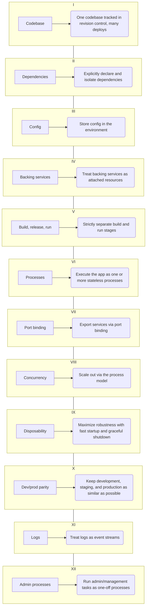

# 12 Factor Apps

## Who should read this document?

Any developer building applications which run as a service. Ops engineers who deploy or manage such applications.

***

## Introduction

In the modern era, software is commonly delivered as a service: called web apps, or software-as-a-service. The
twelve-factor app is a methodology for building software-as-a-service apps that:

Use declarative formats for setup automation, to minimize time and cost for new developers joining the project;
Have a clean contract with the underlying operating system, offering maximum portability between execution environments;
Are suitable for deployment on modern cloud platforms, obviating the need for servers and systems administration;
Minimize divergence between development and production, enabling continuous deployment for maximum agility;
And can scale up without significant changes to tooling, architecture, or development practices.
The twelve-factor methodology can be applied to apps written in any programming language, and which use any combination
of backing services (database, queue, memory cache, etc).

> A set of rules and design principles making an app more stable and robust.
> - making an application horizontally scalable.
> - language and framework agnostic.
{: .prompt-info }

***


# [What are 12 Factor Apps and Why Should You Care?](https://www.youtube.com/watch?v=REbM4BDeua0 "Ben Porter's in-depth on the rules")

```plaintext
l.    Codebase: One codebase tracked in revision control, many deploys
ll.   Dependencies: Explicitly declare and isolate dependencies
III.  Config: Store config in the environment
IV.   Backing services: Treat backing services as attached resources
V.    Build, release, run: Strictly separate build and run stages
Vl.   Processes: Execute the app as one or more stateless processes
VII.  Port binding: Export services via port binding
VIII. Concurrency: Scale out via the process model
IX.   Disposability: Maximize robustness with fast startup and graceful shutdown
X.    Dev/prod parity: Keep development, staging, and production as similar as possible
XI.   Logs: Treat logs as event streams
XII.  Admin processes: Run admin/management tasks as one-off processes
```

***

## Why care about 12 Factor?

- keep your app scalable
- enable agile workflow CI/CD
- portable between platforms-> moving aps from one platform to another
- baseline expectation for others
- avoid common problems -> many devs reinvent the wheel

---

## vertical scaling vs horizontal scaling


### Vertically:

- most easy and intuitive
- runs on 1 machine
- make the box bigger
  - make 4gb ram to 8gb ram
- simply go bigger to run an application

***

### Horizontally

- don't make it bigger, add more servers
- load balancers
- shared storage

***
> If you cannot scale horizontally you will be in a world of pain, because you will max out performance.
{: .prompt-danger }
---

## [The 12 Factor Rules](https://12factor.net/ "Source")



---

## Background

> The contributors to this document have been directly involved in the development and deployment of hundreds of apps,
> and indirectly witnessed the development, operation, and scaling of hundreds of thousands of apps via our work on the
> Heroku platform.

> This document synthesizes all of our experience and observations on a wide variety of software-as-a-service apps in
> the wild. It is a triangulation on ideal practices for app development, paying particular attention to the dynamics of
> the organic growth of an app over time, the dynamics of collaboration between developers working on the app’s codebase,
> and avoiding the cost of software erosion.

> **Our motivation** is to raise awareness of some systemic problems we’ve seen in modern application development, to
> provide a shared vocabulary for discussing those problems, and to offer a set of broad conceptual solutions to those
> problems with accompanying terminology. The format is inspired by Martin Fowler’s books Patterns of Enterprise
> Application Architecture and Refactoring.


***
> Start daily exercises [in the Code Gym](https://codegym.cc/)
> {: .prompt-tip }

# [Start with: Start your journey to become a Java Developer]()

# [Continue with: Database basics]()
